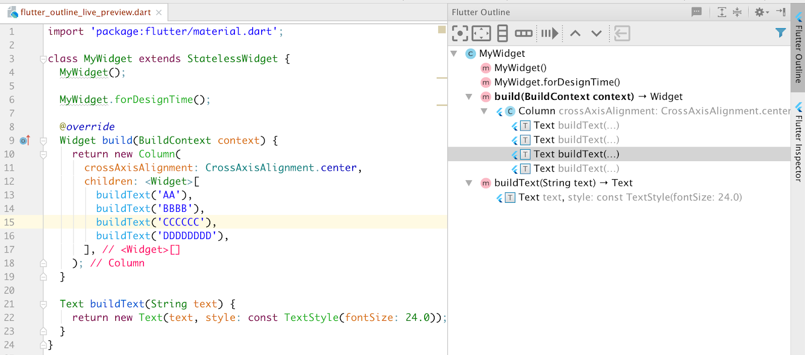

# Section 6: MiCard - How to Build Beautiful UIs with Flutter Widgets

플러터의 **hot reload**는 빠르고 쉽게 UI를 빌드하고, 기능 추가하고, 버그를 고치는데 도움을 준다.


> Hot reload 예시 이미지


**Hot Reload 하는 법**

1. 지원되는 [Flutter 편집기](https://flutter.dev/docs/get-started/editor) 또는 터미널 창 에서 앱을 실행하십시오 . 물리적 또는 가상 장치가 대상이 될 수 있습니다. **디버그 모드의 Flutter 앱만 Hot Reload 할 수 있습니다.**
2. 프로젝트에서 Dart 파일 중 하나를 수정하십시오. 대부분의 코드 변경 유형은 Hot Reload 할 수 있습니다. Hot Restart가 필요한 변경 사항 목록은 [제한 사항을](https://flutter.dev/docs/development/tools/hot-reload#limitations) 참조하십시오 .
3. Flutter의 IDE 도구를 지원하는 IDE / 편집기에서 작업중인 경우 **모두 저장** ( `cmd-s`/ `ctrl-s`)을 선택 하거나 도구 모음에서 Hot Reload 버튼을 클릭하십시오.

> Flutter 공식 문서 참조 (https://flutter.dev/docs/development/tools/hot-reload)


## Hot Reload and Hot Restart - Flutter Power tools

**Hot Reload** 기능을 사용하려면 **Stateless, Stateful** 위젯을 사용해야 한다.


**Hot Reload와 Hot Start의 차이**

- **Hot Reload**: state를 유지한 체 바뀐 위젯을 다시 그려준다.
- **Hot Start**: state를 초기화하고 다시 위젯을 그린다.


## How to use Widjets

Widjet의 사용법을 설명해주었다.

**언급한 위젯들**

- Layout Widjets: https://flutter.dev/docs/development/ui/layout
- Center: https://api.flutter.dev/flutter/widgets/Center-class.html
- Padding: https://api.flutter.dev/flutter/widgets/Padding-class.html
- SafeArea: https://api.flutter.dev/flutter/widgets/SafeArea-class.html
- Container: https://api.flutter.dev/flutter/widgets/Container-class.html
- SizedBox: https://api.flutter.dev/flutter/widgets/SizedBox-class.html


> "Document를 활용하십쇼!" - 안젤라 유 선생님


## How to use Custom Font

- fonts 폴더 생성 후 font 파일 넣기
- pubspec.yaml에 명시해주기

```yaml
fonts:
  - family: Pacifico
    fonts:
    # 아래와 같이 font 경로를 넣어준다.
    - asset: fonts/Pacifico-Regular.ttf

  - family: Source Sans Pro
    fonts:
    # 아래와 같이 font 경로를 넣어준다.
    - asset: fonts/SourceSansPro-Regular.ttf
```


# Section 7: Dicee -Building Apps with State

## How to Use Intention Actions



> 안드로이드 스튜디오의 Flutter Outline탭

**Flutter Outline**을 통해서 위젯과 위젯 중간에 다른 위젯을 추가할 수도 있고, 어떤 위젯이 코드의 몇번째 줄에 위치하는지를 직관적으로 알 수 있다.


## Adding Gesture Detection with Flutter Button

버튼 위젯들의 소개가 있었다.

- RaisedButton: https://api.flutter.dev/flutter/material/RaisedButton-class.html
  
- FlatButton: https://api.flutter.dev/flutter/material/FlatButton-class.html
  

각 버튼 위젯에 Property 중 **onPressed** 옵션에서 **callback 함수**를 등록해서 버튼의 기능을 구현했다.


## Stateful vs Stateless Widgets - What's the Difference

**Stateful** 위젯은 **state**를 관리하는 위젯이고,
**Stateless** 위젯은 **state**의 관리가 없다.

코드 상으로는 아래의 코드를 활용한다면 **Stateful** 위젯이다.

```dart
setState((){
	//do something
});
```


# Section 8: Boss Level Challenge 1 - Magic 8 Ball

## 결과물


