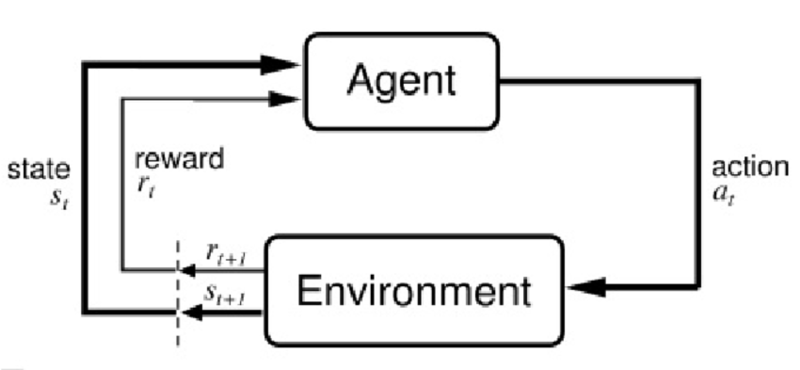
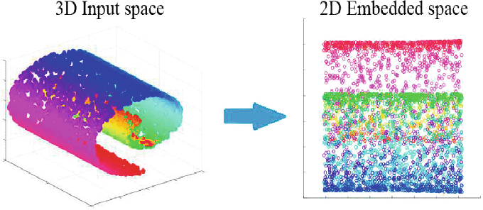

#  1장 컴퓨터는 데이터에서 배운다

머신러닝의 주요 개념과 종류를 배운다. 관련 용어 소개와 머신러닝 기술을 실제 문제 해결에 성공적으로 적용할 수 있는 초석을 다진다.

- 머신 러닝의 일반적 개념 이해하기
- 세 종류의 학습과 기본 용어 알아보기
- 성공적인 머신 러닝 시스템을 설계하는 필수 요소 알아보기
- 데이터 분석과 머신 러닝을 위한 파이썬을 설치하고 설정하기

## 1.1 데이터를 지식으로 바꾸는 지능적인 시스템 구축

현대 기술에는 **정형** 또는 **비정형** **데이터**가 풍부하다.

20세기 후반에 데이터에서 지식을 추출하여 예측하는 자기 학습(self-learning) 알고리즘과 관련된 인공지능(Artificial Intelligent, AI)의 하위 분야로 머신러닝이 출현했다.

머신러닝이 실생활에 큰 역할을 하고 있다.

예) 이메일 스팸 필터, 편리한 텍스트, 음성 인식, 웹 검색 엔진, 체스 대결 프로그램 등

## 1.2 머신러닝의 세 가지 종류

**머신 러닝의 세가지 종류**

- 지도 학습(supervised learning)
  - 레이블된 데이터
  - 직접 피드백
  - 출력 및 미래 예측
- 비지도 학습(unsupervised learning)
  - 레이블 및 타깃 없음
  - 피드백 없음
  - 데이터에서 숨겨진 구조 찾기
- 강화 학습(reinforcement learning)
  - 결정 과정
  - 보상 시스템
  - 연속된 행동에서 학습

### 1.2.1 지도 학습으로 미래 예측

- **지도 학습**의 주요 목적: 레이블(label)
  - 지도(supervised): 희망하는 출력 신호(레이블)가 있는 일련의 샘플

예) 스팸 메일 예측

- **분류(classification)**
  - 지도 학습의 하위 카테고리
  - 클래스 레이블은 이산적(discrete)이고 순서가 없어 샘플이 속한 그룹으로 이해할 수 있다.
  - 이진 분류(binary classification)
  - 다중 분류(multiclass classification)
  - 결정 경계(decesion boundary)
- **회귀(regression)**
  - 연속적인 출력 값 예측
  - 예측 변수(predictor variable 또는 설명변수(explanatory variable), 입력(input))와 연속적인 반응 변수(response variable 또는 출력, 타깃)가 주어질 때 출력 값을 예측하는 두 변수 사이의 관계를 찾는 것.
  - 선형 회귀(linear regression)
  - 절편(intercept)

### 1.2.2 강화 학습으로 반응형 문제 해결

**환경**과 상호 작용하여 시스템(**에이전트**(agent)) 성능을 향상하는 것이 목적

환경의 현재 상태 정보는 **보상**(reward) 신호를 포함하기 때문에 강화학습을 지도 학습과 관련된 분야로 생각할 수 있다. 강화 학습의 피드백은 **정답**(ground truth) 레이블이나 값이 아니다. 보상 함수로 얼마나 행동이 좋은지를 측정한 값이다. 에이전트는 환경과 상호 작용하여 보상이 최대화되는 일련의 행동을 강화 학습으로 학습한다. 탐험적인 시행착오(trial and error) 방식이나 신중하게 세운 계획을 사용한다. 

예) 체스 게임(체스판의 상태(환경)에 따라 기물의 이동을 결정함)

이 책에서는 강화학습을 여기서 마무리한다.

### 1.2.3 비지도 학습으로 숨겨진 구조 발견

비지도 학습에서는 레이블되지 않거나 구조를 알 수 없는 데이터를 다룬다.

**군집: 서브그룹 찾기**

**군집**: 사전 정보 없이 쌓여 있는 그룹 정보를 의미 있는 서브그룹(subgroup)  또는 **클러스터**(cluster)로 조직하는 탐색적 데이터 분석 기법

**차원 축소: 데이터 압축**

차원 축소(dimensionality reduction)는 고차원 데이터를 다루어야 하는 경우는 흔하다.

비지도 차원 축호는 잡음(noise) 데이터를 제거하기 위해 특성 전처리 단계에서 종종 적용하는 방법.
(잡음이 특정 알고리즘의 예측 성능을 감소시킬 수 있다.)

더 작은 차원의 부분 공간(subspace)으로 데이터를 압축한다.

데이터 시각화(산점도(scatterplot) ,히스토그램(histogram))에도 유용함.

비선형(nonlinear) 차원 축소를 통해 3D 스위스롤(swiss roll)을 압축한 모습

## 1.3 기본 용어와 표기법 소개

## 1.4 머신 러닝 시스템 구축 로드맵

## 1.5 머신 러닝을 위한 파이썬

## 1.6 요약

