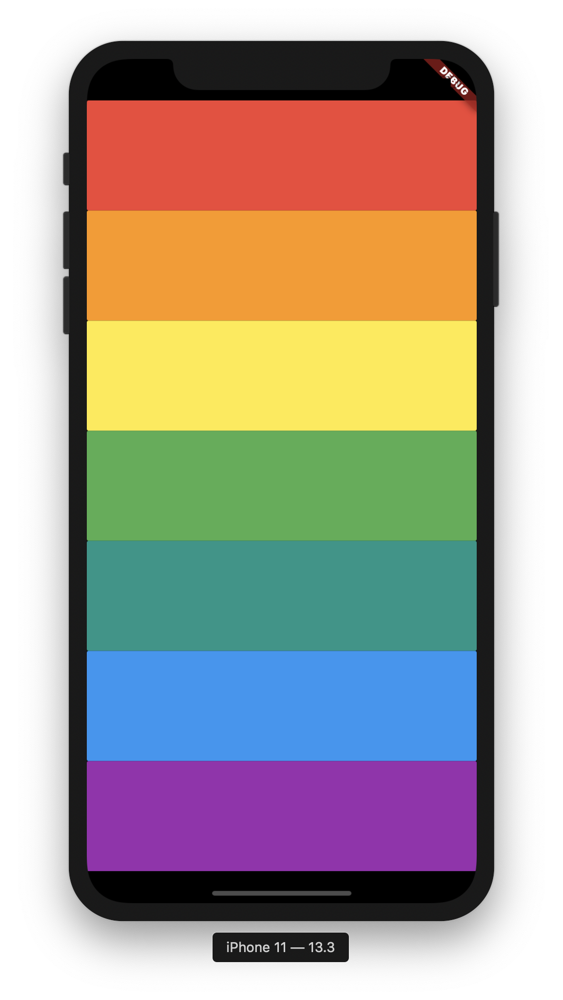
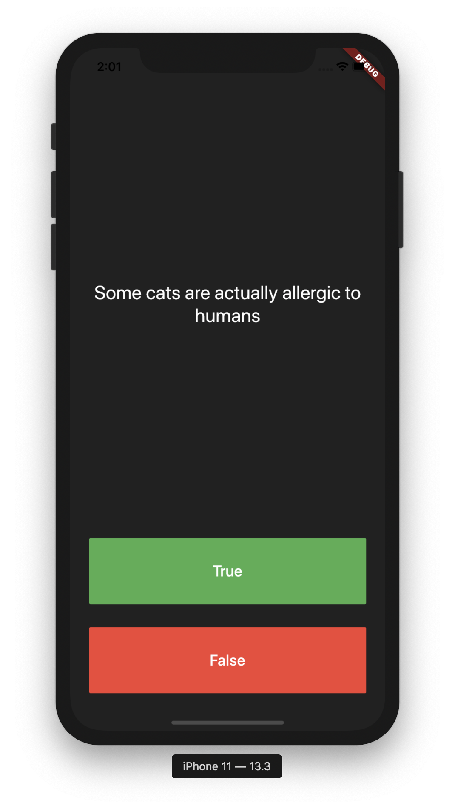

# Section 9: Xylophone - Using Flutter and Dart Packages to Speed Up Development



## Dart Packages

Flutter Package는 open source library code이며
http://pub.dartlang.org/flutter
에서 찾아 사용할 수 있다.

**이번 주차에서 소개한 패키지들**

- cupertino_icons
- generates_words
- shared_preferences 
  (플러터 팀에서 만들어서 성능이 괜찮다고 한다.)
- audioplayers: ^0.13.7

***pubspec.yaml* 파일에 기술해서 사용한다.**


**아래와 같이 패키지 버전을 명시하거나 안할 수 있다.**

```yaml
dependencies:
  english_words
  english_words: ^3.2.1
```

**설치방법**

```shell
(안드로이드 스튜디오)
packages get 클릭

(터미널 사용법1)
$ flutter pub get

(터미널 사용법2)
$ flutter packages get
```

**사용법**

```dart
import 'package:<패키지 이름>.dart';
```

## Dart 기초

아래의 기초 개념을 설명했다.

- Function
- Arrow Function
- 클래스 멤버 변수에 _(언더바)를 추가하면 private 변수가 된다.


# Section 10:  Quizzler -Modularising & Organising Flutter Code


## Dart Package 사용 (rflutter_alert)

https://pub.dev/packages/rflutter_alert
위 주소에 설치 방법과 사용 방법이 명시되어 있다.

### 설치 방법

**pubspec.yaml에 추가**

````yaml
dependencies:
  rflutter_alert: ^1.0.3
````

**설치 하기**

```shell
$ flutter pub get
```

**import 하기**

```dart
import 'package:rflutter_alert/rflutter_alert.dart';
```


## 겪었던 문제

**문제**: quizBrain.getQuestionText() 함수가 Null 값을 반환하는 문제가 있었다.

**솔루션**: 에뮬레이터를 다시 실행하니 해결 되었다.

**이유**: 위젯 렌더링 되고 나서 quizBrain 인스턴스의 생성자가 작동하기 때문이었다.
클래스 생성 후에 클래스 초기화 되는 과정과 위젯 생성하는(Hot Reload) 순서가 꼬였나봄.

## Dart 기초

아래의 OOP 개념들을 설명했다.

- List

- IF/ELSE
- Classes and Objects
- Abstraction
- Encapsulation
- Inheritance
- Polymorphism
