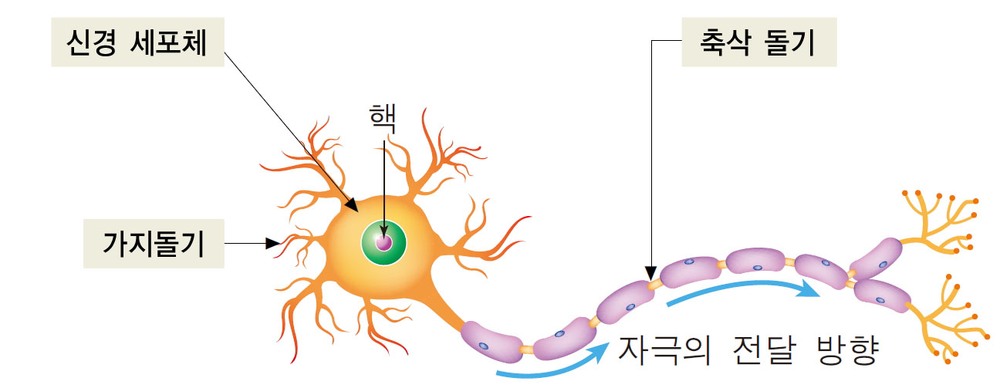

**한국외대 DSC(Developer Student Club)** 멤버들과 함께 머신러닝 스터디를 진행하면서 "**머신 러닝 교과서**"를 블로그에 정리한 내용이다.

---

2장에서는 분류를 위한 초창기 머신 러닝 알고리즘인 **퍼셉트론**과 **적응형 선형 뉴런** 두개를 사용한다. 이 두 알고리즘에 대해 이해하고, 파이썬을 사용한 효율적인 구현 방법을 익히는데 도움이 될 것이라고 한다. 아래 3가지를 2장에서 주로 다룬다고 한다.

- 머신 러닝 알고리즘을 직관적으로 이해하기
- Pandas, Numpy, Matplotlib으로 데이터를 읽고 처리하고 시각화하기
- 파이썬으로 선형 분류 알고리즘 구현하기

---

# 인공 뉴런: 초기 머신 러닝의 간단한 역사

AI를 설계하기 위해 생물학적 뇌가 동작하는 방식을 이해하려는 시도로, **1943년** **워런 맥컬록**(Warren McCulloch)과 **월터 피츠**(Walter Pitts)는 처음으로 간소화된 뇌의 **뉴런** 개념을 발표했다. 이를 **맥컬록-피츠**(MCP) 뉴런이라고 한다. 뉴런들은 뇌의 신경 세포와 서로 연결되어 있다. 아래 그림과 같이 화학적, 전기적 신호를 처리하고 전달하는 데 관여한다.

> 출처: http://study.zum.com/book/11779

몇 년 후에 **프랑크 로젠블라트**(Frank Rosenblatt)는 MCP 뉴런 모델을 기반으로 퍼셉트론 학습 개념을 처음 발표했다. 퍼셉트론 규칙에서 로젠 블라트는 자동으로 최적의 **가중치를 학습**하는 알고리즘을 제안했다. 이 가중치는 뉴런의 출력 신호를 낼지 말지를 결정하기 위해 입력 특성에 곱하는 계수이다. 지도 학습과 분류 개념으로 말하면 이 알고리즘으로 샘플이 한 클래스에 속하는지 아닌지를 예측할 수 있다.

## 인공 뉴런의 수학적 정의

인공 뉴런(artificial neuron) 아이디어는 두 개의 클래스가 있는 이진 분류(binary classification) 작업으로 볼 수 있다. 두 클래스는 간단하게 1과 -1(양성 클래스와 음성 클래스)로 나타낸다. 그 다음 입력 값 x와 이에 상응하는 가중치 벡터 w의 선형 조합으로 결정 함수를 정의한다. **최종 입력**(net input)인 $z$는 아래와 같다.
$$
w = \begin{bmatrix}
           w_{1} \\
           \vdots \\
           w_{m}
         \end{bmatrix}
,
x = \begin{bmatrix}
           w_{1} \\
           \vdots \\
           w_{m}
         \end{bmatrix}
$$

$$
z = w_1x_1 + \dots + w_mx_m
$$

이제 특정 샘플 $x^i$의 최종 입력이 사전에 정의된 임계 값 $\theta$ 보다 크면 클래스 1로 예측하고, 그렇지 않으면 클래스 -1로 예측한다. 퍼셉트론 알고리즘에서 결정 함수 $\phi(.)$ 는 **단위 계단 함수**(unit step function)을 변형한 것이다.
$$
\phi(z) = \begin{cases}1 & z \ge \theta  일 때 \\ 
-1 & \mbox{그외} \end{cases}
$$
아래의 그림은 퍼셉트론 결정 함수로 최종 입력 $z$ 가 선형적으로 구별되는 모습이다.

> 출처: https://en.wikipedia.org/wiki/Perceptron

## 퍼셉트론 학습 규칙

앞서 배운 MCP 뉴런과 로젠블라트의 임계 퍼셉트론 모델은 **환원주의**(reductionism) 접근 방식을 사용한 것이다.  즉, 출력을 내거나 내지 않는 두 가지 경우만 있다. 따라서 로젠블라트의 초기 퍼셉트론 학습 규칙은 아래와 같이 매우 간단하다.

1. 가중치를 0 또는 랜덤한 작은 값으로 초기화 한다.

2. 각 훈련 샘플 $x^i$ 에서 다음 작업을 한다.

   a. 출력 값 $ \hat y$ 를 계산한다.

   b. 가중치를 업데이트한다.

가중치를 업데이트 할 때 **학습률**(learning rate)이 필요하다. (일반적으로 0.0에서 1.0 사이 실수이다) 가중치 업데이트 방법은 아래와 같다.

$Δ𝑤^i=𝜂𝑥^𝑖(𝑦′−𝑦)$

한 번의 업데이트로 납득할만한 결과가 안 나올 겨우 훈련 데이터셋을 반복할 최대 횟수(**에포크**(epoch))를 지정하고 분류 허용 오차를 지정할 수 있다. 다음 절에서는 파이썬으로 이 식들을 실제로 구현한다.

> 출처: https://www.simplilearn.com/what-is-perceptron-tutorial

