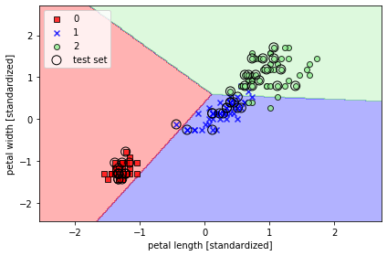

**한국외대 DSC(Developer Student Club)** 멤버들과 함께 머신러닝 스터디를 진행하면서 "**머신 러닝 교과서**"를 블로그에 정리한 내용이다.

사이킷런을 진행하기 전에 분류 모델을 다루는 머신러닝 알고리즘을 위해 다섯 가지 주요 단계에 대해 이야기 해보려고 합니다.

1. 특성을 선택하고 훈련 샘플을 모은다.
2. 성능 지표를 선택한다.
3. 분류 모델과 최적화 알고리즘을 선택한다.
4. 모델의 성능을 평가한다.
5. 알고리즘을 튜닝한다.

---

실습에서 붓꽃 데이터셋을 사용합니다. 150개의 꽃 샘플에서 꽃잎 길이와 꽃잎 너비를 특성 행렬 X에 할당하고 이에 상응하는 꽃 품종에 해당하는 클래스 레이블을 벡터 y에 할당합니다.

```python
from sklearn import datasets
import numpy as np

iris = datasets.load_iris()
X = iris.data[:, [2,3]]
y = iris.target
print('클래스 레이블:', np.unique(y))

# 클래스 레이블: [0 1 2]
```

  

훈련 데이터와 테스트 데이터를 7:3 비율로 랜덤하게 나눠주는 사이킷런의 model_selectio 모듈의 train_test_split 함수를 사용했다. 이 경우 훈련 데이터는 105개, 테스트 데이터는 45개가 됩니다.

```python
from sklearn.model_selection import train_test_split
X_train, X_test, y_train, y_test = train_test_split(X, y, test_size=0.3, random_state=1, stratify=y)
```

  

StandardScaler 클래스로 특성을 표준화합니다. fit 함수로 $\mu$ (평균),  $\sigma$ (표준 편차)를 계산하고, transform 함수로 데이터셋을 표준화합니다.

```python
from sklearn.preprocessing import StandardScaler

sc = StandardScaler()
sc.fit(X_train)
X_train_std = sc.transform(X_train)
X_test_std = sc.transform(X_test)
```

  

표준화 한 데이터를 Perceptron에 주입합니다.

```python
from sklearn.linear_model import Perceptron

ppn = Perceptron(max_iter=40, eta0=0.1, tol=1e-3, random_state=1)
ppn.fit(X_train_std, y_train)
```

  

y_pred는 X_test_std 값으로 예측한 결과 데이터입니다. accuracy_score는 예측 결과 값과 실제 결과 값의 비교를 통해 정확도를 추축해줍니다. 정확도 계산은 $1-error$ 로 계산합니다. 사이킷런의 분류기는 예측 정확도를 계산하는 score 메서드를 가지고 있습니다. 이 메서드는 predict 메서드와 accuracy_score 메서드를 연결하여 정확도를 계산합니다.

```python
y_pred = ppn.predict(X_test_std)
print('잘못 분류된 샘플 개수: %d' % (y_test != y_pred).sum())

from sklearn.metrics import accuracy_score
print('정확도: %.2f' % accuracy_score(y_test, y_pred))
print('정확도: %.2f' % ppn.score(X_test_std, y_test))
```

  

다음은 분류된 데이터를 시각화 하는 코드입니다.

```python
from matplotlib.colors import ListedColormap
import matplotlib.pyplot as plt


def plot_decision_regions(X, y, classifier, test_idx=None, resolution=0.02):

    # 마커와 컬러맵을 설정합니다.
    markers = ('s', 'x', 'o', '^', 'v')
    colors = ('red', 'blue', 'lightgreen', 'gray', 'cyan')
    cmap = ListedColormap(colors[:len(np.unique(y))])

    # 결정 경계를 그립니다.
    x1_min, x1_max = X[:, 0].min() - 1, X[:, 0].max() + 1
    x2_min, x2_max = X[:, 1].min() - 1, X[:, 1].max() + 1
    xx1, xx2 = np.meshgrid(np.arange(x1_min, x1_max, resolution),
                           np.arange(x2_min, x2_max, resolution))
    Z = classifier.predict(np.array([xx1.ravel(), xx2.ravel()]).T)
    Z = Z.reshape(xx1.shape)
    plt.contourf(xx1, xx2, Z, alpha=0.3, cmap=cmap)
    plt.xlim(xx1.min(), xx1.max())
    plt.ylim(xx2.min(), xx2.max())

    for idx, cl in enumerate(np.unique(y)):
        plt.scatter(x=X[y == cl, 0], 
                    y=X[y == cl, 1],
                    alpha=0.8, 
                    c=colors[idx],
                    marker=markers[idx], 
                    label=cl, 
                    edgecolor='black')

    # 테스트 샘플을 부각하여 그립니다.
    if test_idx:
        X_test, y_test = X[test_idx, :], y[test_idx]

        plt.scatter(X_test[:, 0],
                    X_test[:, 1],
                    c='',
                    edgecolor='black',
                    alpha=1.0,
                    linewidth=1,
                    marker='o',
                    s=100, 
                    label='test set')

X_combined_std = np.vstack((X_train_std, X_test_std))
y_combined = np.hstack((y_train, y_test))

plot_decision_regions(X=X_combined_std, y=y_combined,
                      classifier=ppn, test_idx=range(105, 150))
plt.xlabel('petal length [standardized]')
plt.ylabel('petal width [standardized]')
plt.legend(loc='upper left')

plt.tight_layout()
plt.show()
```





이번 절은 사이킷런으로 퍼셉트론 실습을 해보았습니다. 책에서는 numpy와 시각화에 대한 코드 설명이 약간 부족한 감이 있어 아쉬웠습니다.


