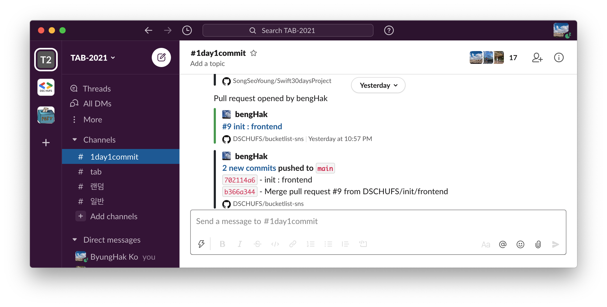
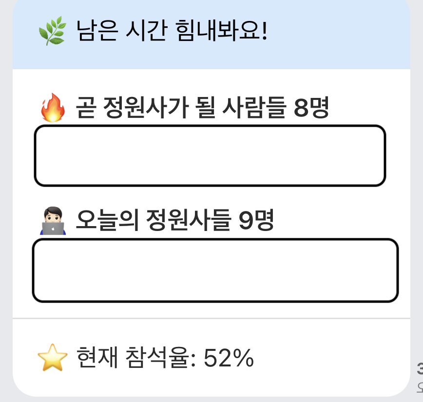
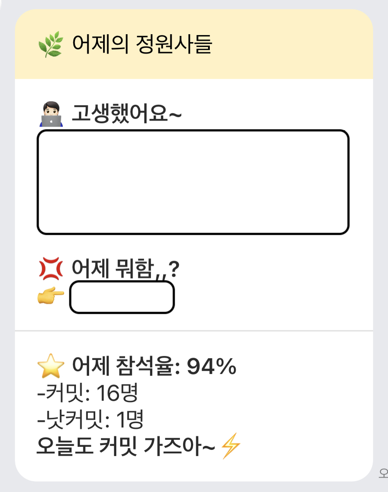
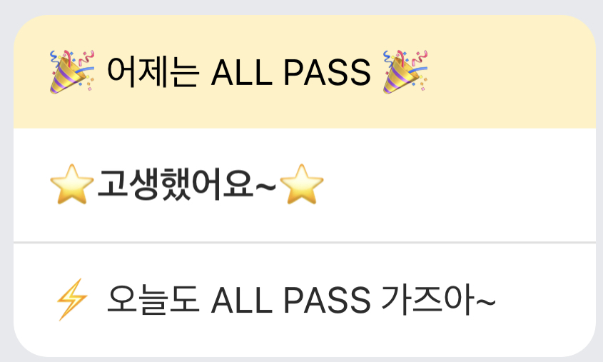

# 새해 결심으로 시작하는 "정원사들" 프로젝트

2021년 새해를 맞이하면서 동아리에서 **"정원사들"** 프로젝트를 시작했습니다.  
정원사들이란 **1일1커밋**을 하면서 깃헙에 있는 잔디밭을 가꿔가는 것을 목표로 하는 프로젝트입니다.
이 프로젝트는 기존에 GDG 판교에 계셨던 김준호님께서 진행한 프로젝트였고, 이 아이디어를 학교로 가져와서 학우들과 진행하게 되었습니다.


## 정원사들 프로젝트 진행은 다음과 같습니다.

1. 하루에 한 번 커밋하는 것을 목표로 한다. (커밋한 내용이 Slack에 업데이트 된다.)

2. 커밋과 함께 배운 내용들을 정리하여 TIL에 작성한다.



# 정원사들 프로젝트를 도와주는 시스템

이 프로젝트를 진행하면서 멤버들의 의지와 열정을 지켜주기 위해 동기부여하는 커밋 출석부가 있었습니다.  
작년에는 [김준호](https://github.com/junho85/garden5)님께서 구현해주신 시스템으로 슬랙에 올라오는 커밋 기록들을 수집해서 웹에서 그 기록들을 볼 수 있었습니다.

## 올해는 직접 구현해보자!

작년과 다르게 올해는 시스템을 직접 구축해보고 싶었습니다. 작년에는 웹으로 동기부여를 했다면 올해는 카카오워크 Bot을 통해 멤버들의 커밋 현황을 하루에 두번 알림을 주어 동기부여를 해보고 싶었습니다.

## 왜 굳이 카카오워크 Bot을 사용했나

1. 슬랙 알림이 있지만 슬랙을 불편해하는 멤버가 있었음

2. 새롭게 생긴 카카오워크에 대한 개인적인 호기심

# 프로젝트 구성요소

```
1. Node.js
2. Express - 기록된 커밋 기록들을 REST API로 제공하는 역할
3. Postgresql - 커밋 기록 저장소 역할
4. Docker, Docker-compose - 프로젝트 쉽게 켜고, 끄기
5. Slack API - Node.js에서 Slack 메시지들을 읽는 역할
6. Kakaowork Bot - 커밋한 상태에 따라 사용자들에게 동기부여 연락 보내기
```

# 카카오워크 알림 봇

카카오워크 Bot을 사용하는 방법은 생각보다 어렵지 않았습니다. 가이드 문서를 읽어가면서 아래 작업들을 했습니다.  
(가이드문서: https://docs.kakaoi.ai/kakao_work/botdevguide/process/)

- Users: https://docs.kakaoi.ai/kakao_work/webapireference/users/
- Conversations: https://docs.kakaoi.ai/kakao_work/webapireference/conversations/
- Messages: https://docs.kakaoi.ai/kakao_work/webapireference/messages/

가이드 문서를 통해 Bot 개발하는 것은 재밌는 경험이었으나, 카카오워크 자체의 안정성이 떨어진다는 것을 느꼈습니다. 간혹 채팅을 보냈지만 상대방이 늦게 받는다거나 단톡방을 개설해도 제대로 보이지 않는 등의 불편한 점들이 있었습니다.  
카카오톡에 익숙한 학우들을 대상으로 하는 것이 아니었다면 Slack으로 알림을 보내지 않았을까,,,

# 마무리

구현한 백엔드를 사용해서 사용자들에게 동기부여 알림을 보냅니다. 두번 보내는데 한번은 오전 10시에 전날 커밋 결과, 오후 10시에 오늘 커밋 결과를 보냅니다. 아래는 멤버들을 응원(독촉?)하는 알림입니다!





현재까지 95%의 출석율을 유지하고 있습니다. 작년에는 88%의 출석율로 마무리했었는데 이번 알림봇을 통해 작년보다 더 나은 출석율로 마무리했으면 하는 바람입니다. ㅎㅎ

**다들 새해 복 많이 받으시고, 구현한 코드에서 에러가 안나길 바래요~**

### 프로젝트 깃헙: https://github.com/bengHak/github-commit-crawler
